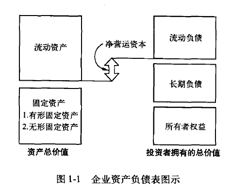
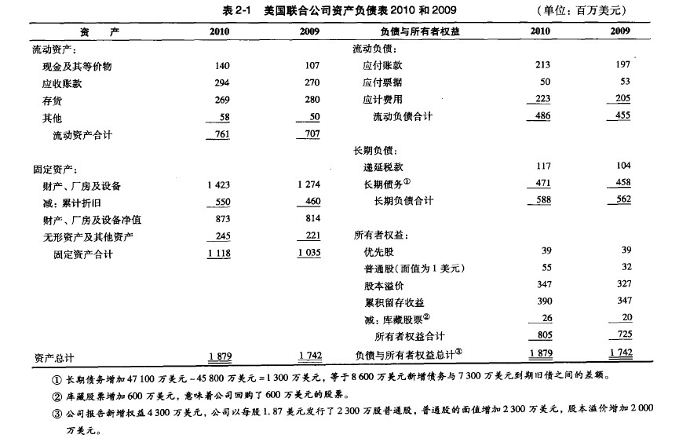
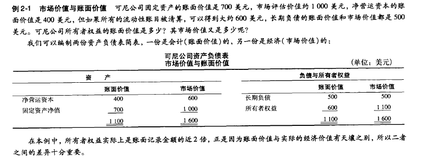

# 公司理财
[TOC]
## 第一章：公司理财导论
### 1.1 什么是公司理财？
公司理财负债表模型

### 1.2 企业组织
* 个人独资：企业为一个人所拥有
* 合伙人：两个或两个人以上共同拥有一个企业
* 公司：目前最重要的一种企业形式，一种独立的法人实体，可以拥有名称，并享有一些自然人所拥有的权利 
* 其他：略

### 1.3 现金流的重要性
这部分不是很懂。先跳过。大概讲了现金流很重要。

### 1.4 财务管理的目标
对于营利性组织，财务的目标就是为了其所有者赚取利润或者增加价值。

#### 1.4.1 可能的目标
这些可能的目标，都比较模糊，也比较难。
* 生存
* 避免财务困境和破产
* 在竞争中获胜
* 成本最小化
* 利润最大化
* 维持盈利的稳步增长
#### 1.4.2 财务管理的目标（相对明确的）
财务管理代表公司的股东进行财务决策，那么对股东而言，什么是一个好的财务决策？假定股东在乎是获取利润，那么最大化股东利益的决策就是好的决策。那么可以得出这样一个结论，财务管理的目标是为了：最大化现有股票的每股的股价。
#### 1.4.3 更一般的目标
如果公司没有股票，那上述结论就不成立。可以稍作扩展:公司股票的价值就是公司所有者权益的价值。那么更一般的财务管理目标可以这么描述：最大化现有所有者权益的市场价值。

### 1.5 代理问题和公司的控制
对于大型公司而言，所有权可能分散在大量的投资者中。这种情况下，公司的管理者是否真的必然会保护股东的利益吗？是否会为了自己的利益而牺牲股东的利益。
#### 1.5.1 代理关系
* 代理关系：当委托方雇佣另外一方代理方代表他的利益时，代理关系就产生了。股东和管理者之间的关系就是一种代理关系。
* 代理问题：委托方和代理方之间可能会有利益冲突，这种冲突就是“代理问题”。
#### 1.5.2 管理层目标
代理成本：股东和管理层之间利益冲突的成本。可以是直接的，也可以是间接的。
#### 1.5.3 管理者是否为股东的利益行事
管理人员薪酬和公司的控制权。
#### 1.5.4 利益相关者
职工、顾客、供应商甚至政府在公司中都有某些财务方面的利益。这些被称之为“利益相关者”。

### 1.6 法律法规 
美国：联邦法律法规对公司产生的主要约束就是要求其向投资者或潜在投资者披露相关信息。其目的在于使所有投资者都拥有相同的信息，从而降低利益冲突。当然，法律需要额外的成本，而任何关于法律的分析也都需要同时涵盖成本和收益的部分。

#### 1.6.1 1993年的证券法以及1994年的证券交易法
美国的实例法案，作为案例学习即可。

#### 1.6.2 《萨班斯-奥克斯利法案》
又被称为“Sarbox”，旨在保护投资者不因公司滥用职权而受到侵害。

## 第二章：银行及其他金融中介
>公司核销通常意味着公司资产的价值已经贬值，但股东并不会因为公司核销损失几亿美元。理解这种因果关系的主要原因就是：公司最为重要的资源——现金流。本章主要围绕“现金流”进行讲解。
----2017.08.27----
### 2.1 资产负债表
资产负债表：某一特定日期，企业会计价值的一张“快照”。一般分左右两部分:左边是资产，右边是负债和所有者权益。三者有如下关系：
>资产=负债+所有者权益。

分析资产负债表时，企业管理者应该关注这几个方面（不是很理解这里面的必然关系，先记下来）：
* 流动性
* 债务与权益
* 市价与成本

示例如下：

#### 2.1.1 流动性
分析资产负债表，需要关注的第一个方面。相关的几个名词解释：
* **流动性**(liquidity)：指(在不引起价值大幅损失的前提下)资产变现的方便与快捷程度。
* **流动资产**(current assets)：包括现金以及自资产负债表编制之日起一年内能够变现的其他资产。这部分资产，***流动性最强***。
* **应收账款**(accounts receivable)：指销售货物或者提供劳务后应向客户收取而尚未收取的款项(扣减可能发生的坏账后的金额)。
* **存货**(inventory):包括生产用的原材料、在产品及产成品。
* **固定资产**(fixed assets):指流动性不高的一类财产，有形的固定财产包括房地产、厂房及设备，这些设备不随日常业务活动转化为现金，也不用于支付应付工资之类的费用。还有一些固定资产是无形的，比如商标、专利（知识产权），拥有很大的价值（尤其对于互联网以及科技行业）。

资产的流动性越强，对短期债务的清偿能力就越强，**因此，企业避免财务困境的可能性与流动性相关。** 但是，流动资产的收益率一般低于固定资产的收益率，比如现金无法带来投资收益。一定程度上，企业投资于流动性较强的资产是以牺牲对收益性更高的资产的投资机会为代价的。**（风险与收益并存）**

#### 2.1.2 负债
负债(liabilities)是企业所承担的在规定的期限内偿付现金的责任，大多涉及在一定的偿还本息的合同义务。所有者权益(stock-holder's equity)是对企业剩余资产的索取权，它不是固定的。**资产-负债=所有者权益**

#### 2.1.3 市价与成本
企业资本的会计价值通常指置存价值或账面价值。**按照公认会计准则（GAAP），美国经审计的企业财务报表对资产应按成本计价。** 资产并不一定是市场价值，市场价值（market value）是指有意愿的买者与卖者在资产交易中所达成的价格。管理当局的任务就是让企业的市场价值高于成本价值。
举例，说明资产账面价值和市场价值的差异。

## 2.2 利润表
---P18,2017.08.30 by xiaojing wang ---